<h2>Part 1. Установка ОС</h2>

Узнайте версию Ubuntu, выполнив команду cat etc/issue

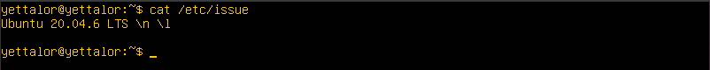

<h2>Part 2. Создание пользователя</h2>

Вставьте скриншот вызова комманды для создания пользователя

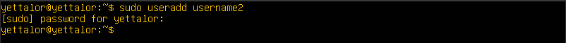

Добавление в группу adm

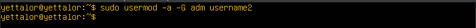

новый пользователь должен быть в выводе комманды cat /etc/passwd

<h2>Part 3. Настройка сети ОС</h2>

Задать название машины вида user-1

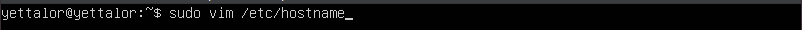

Установить временную зону, соответствующуюю вашему текущему местоположению.

Вывести название сетевых интерфейсов с помощью консольной команды.

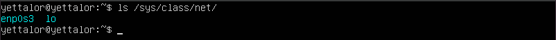

Один из самых основных виртуальных интерфейсов - lo. Это локальный интерфейс, который позволяет программам обращаться к  этому компьютеру. Используя консольную команду получить ip адрес устройства, на котором вы работаете, от DHCP сервера.

Установка

Используя консольную команду получитьь ip адрес устройства, на котором вы работаете, от DHCP сервера.

DHCP - это клиент-серверный протокол динамической конфигурации хоста(Dynamic Host Configuration Protocol), с помощью которого в IT-инфраструктуре сетевые параметры каждого нового устройства прописываются автоматически.

Определить и вывести на экран внешний ip-адрес шлюза (ip) и внутренний IP-адрес шлюза, он же ip-адрес по умолчанию (gw)

Задать статичные (заданные вручную, а не полученные от DHCP сервера) настройки ip, gw, dns (использовать публичный DNS серверы, например 1.1.1.1 или 8.8.8.8)

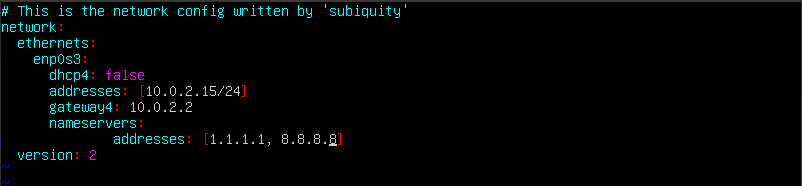

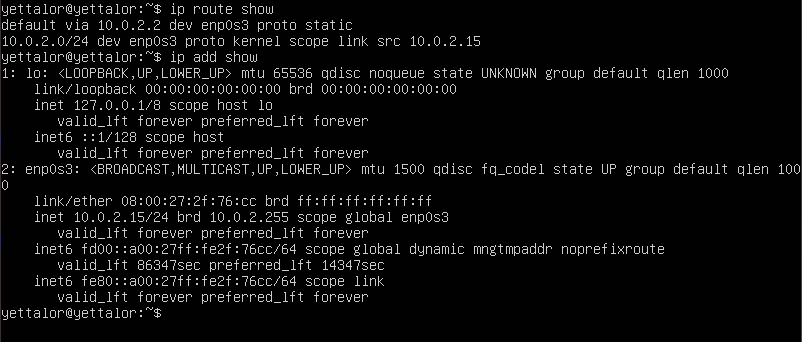

после ребута

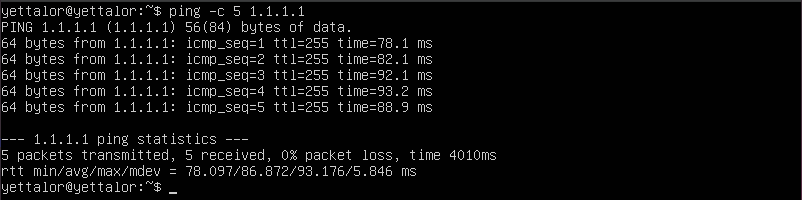
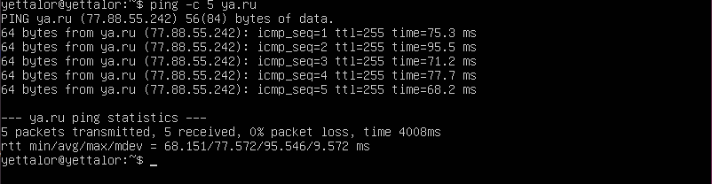

<h2>Part 4. Обновление ОС</h2>

Обновить системные пакеты до последней на момент выполнения задания версии.

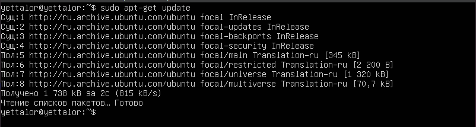

<h2>Part 5. Использование команды sudo</h2>

Разрешить пользователю Part 2 выпольнять команду, sudo.

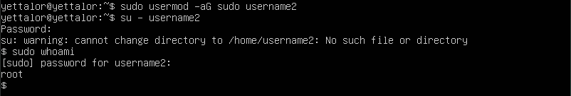

Поменять hostname OC от имени пользователя, созданного в пункте Part 2 (используя sudo)

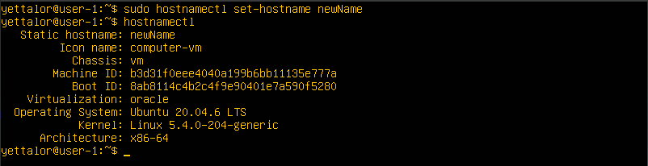

sudo - это утилита, она позволяет временно поднимать привелегии и выполнять задачи администрирования системы

<h2>Part 6. Установка и настройка службы времени</h2>

Настроить службу автоматической синхронизации времени

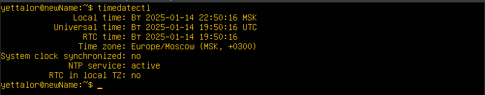

Вывод следующей команды должен содержать NTPSynchronized=yes: timedatectl show

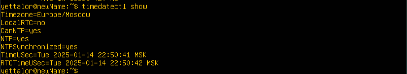

<h2>Part 7. Установка и использование текстовых редакторов</h2>

Установить текстовые редакторы VIM (+ любые два по желанию NANO, MCEDIT, JOE и т.д.)

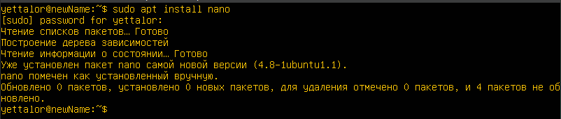
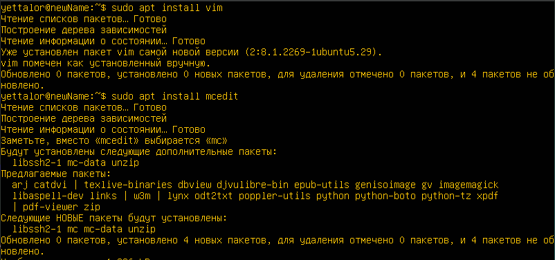

Используя каждый из трех выбранных редакторов, создайте файл test_X.txt, где Х - название редактора, в котором создани файл. Напишите в нем свой никнейм, закройте файл с сохранением изменений.

vim

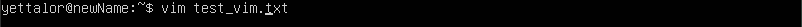
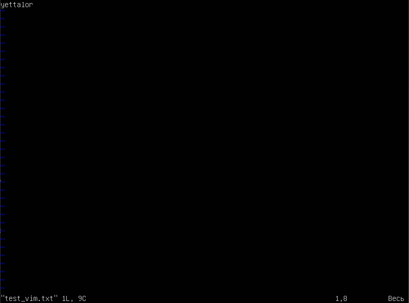

выход: esc + :wq

nano

выход: control+o+x

mcedit

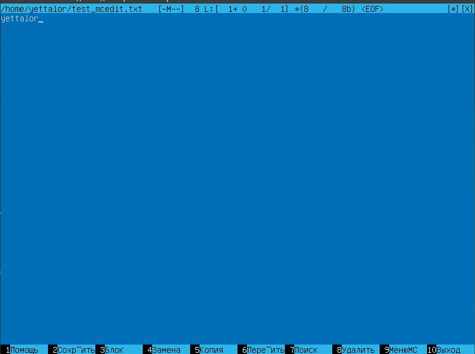

выход: f2+f10

Используя каждый из трех выбранных редакторов, откройте файл на редактирование, отредактируйте файл, заменив никнейм на строку "21 School 21", закройте файл без сохранения изменений. vim

выход:q!

nano

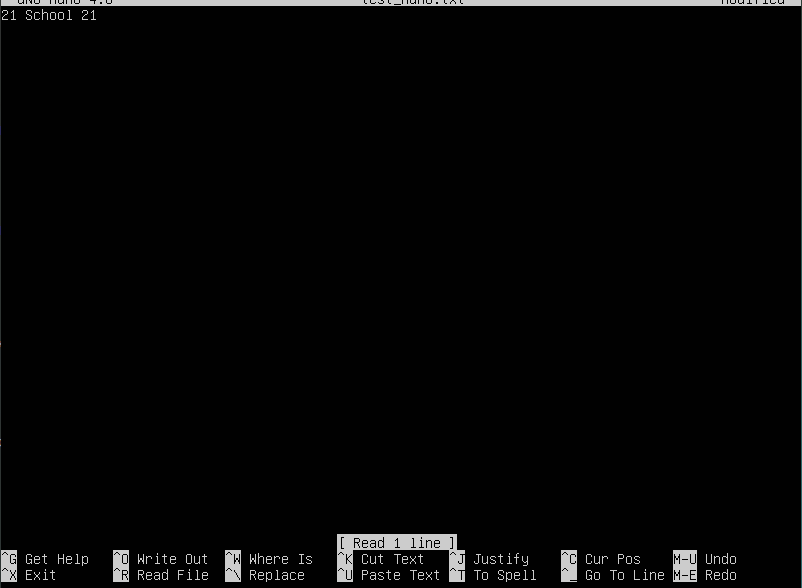

выход: control+x

mcedit

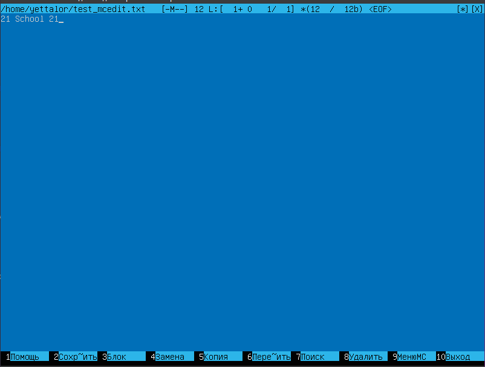

выход: f10

Используя каждый из трех выбранных редакторов, отредактируйте файл ещё раз (по аналогии с предыдущим пунктом), а затем
затем освойте функции поиска по содержимому файла (слово) и замены слова на любое другое.

vim поиск

замена

/- поиск

nano поиск

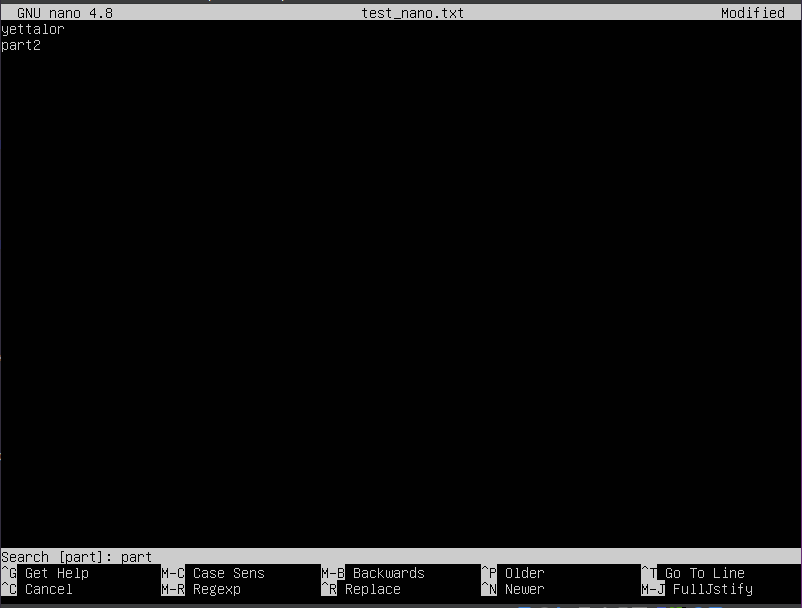

замена - control /

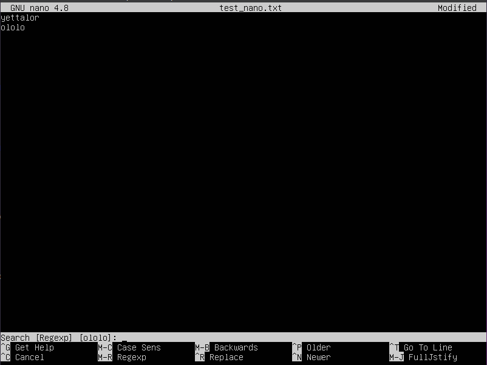

поиск - control w

mcedit

поиск -f7

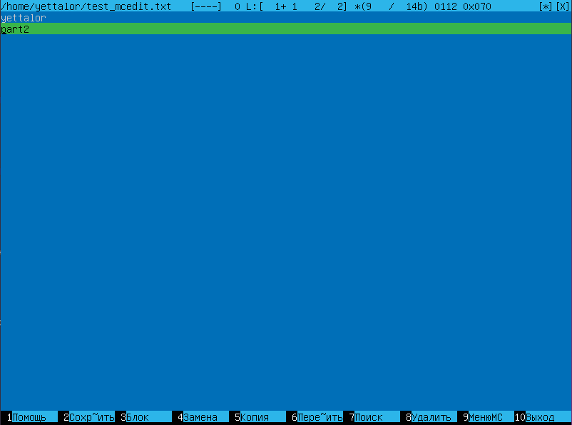

замена - f4

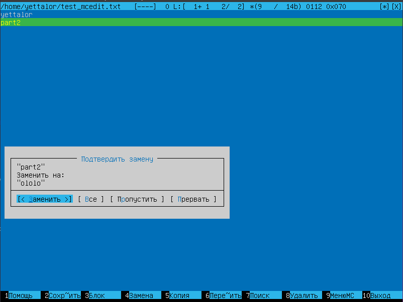

<h2>Part 8. Установка и базовая настройка сервиа SSHD</h2>

Установить службу SSHd.

обновление репозитория

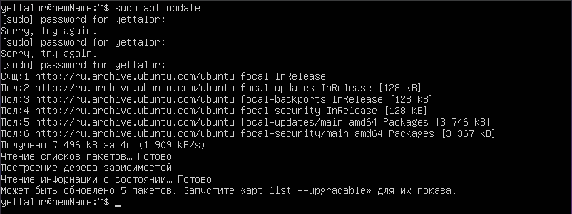

установление ssh

установление OpenSSH

Добавить автостарт службы при загрузке системы.

статус ssh

Перенастроить службу SSHd на порт 2022.

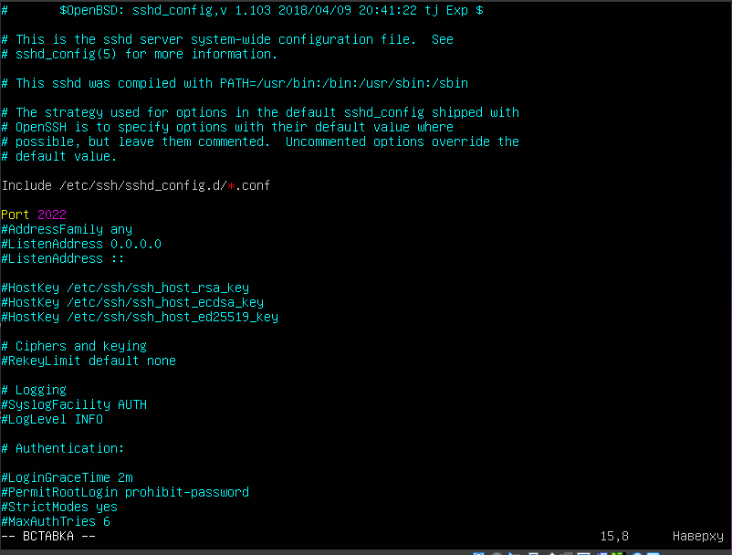

ssh перезапуск для сохранения изменений

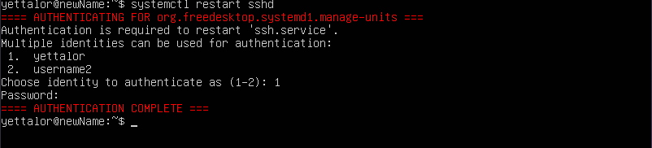

Используя команду ps, показать наличие процесса sshd. Для этого к команде нужно подобрать ключи.

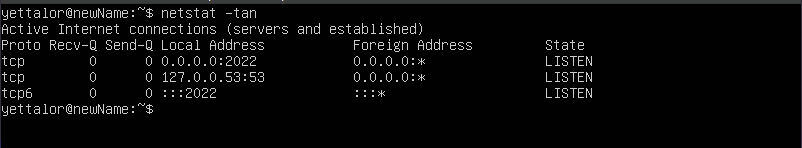

-tan:

t-по протоколу TCP

a-Отображение всех подключений и ожидающих портов.

n- Отображение адресов и номеров портов в числовом формате.

Cтолбцы:

Recv-Q -количество запросов в очередях на приём на данном узле/компьютере

Send-Q -количество запросов в очередях на отправку на данном узле/компьютере

Local Address - адрес и номер локального конца сокета

Foreign Address - адрес и номер порта удаленного порта сокета

State - состояние сокета

Если в качестве адреса отображается 0.0.0.0 , то это означает - "любой адрес", т. е в соединении могут использоваться все IP-адреса существующие на данном компьютере.

ps -aux | grep sshd output:

ps-выводит список текущих процессов на вашем сервере в виде таблицы

a-выбрать все процессы, кроме фоновых;

u-выбрать процессы пользователя.

x-заставляет ps перечислить все процессы, принадлежащие вам

<h2>Part 9. Установка и использование утилит top, htop</h2>

Установить и запустить утилиты top и htop.

top

uptime

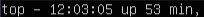

количество авторизованных пользователей

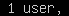

общую загрузку системы

общее количество процессов

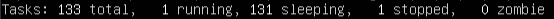

загрузку cpu

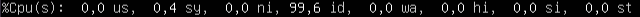

загрузку памяти

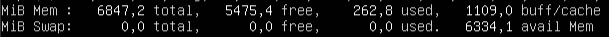

pid процесса занимающего больше всего памяти

pid процесса, занимающего больше всего процессорного времени

htop отсортированному по PID

PERCENT_CPU

PERCENT_MEM

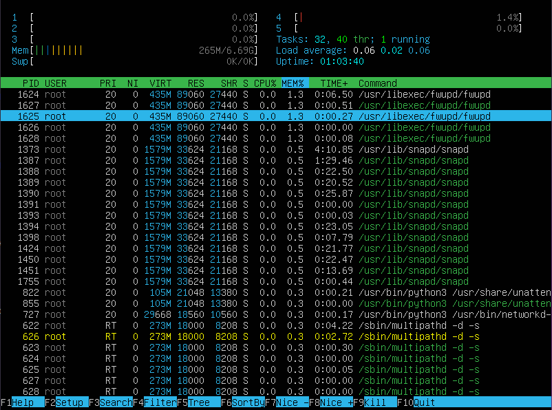

TIME

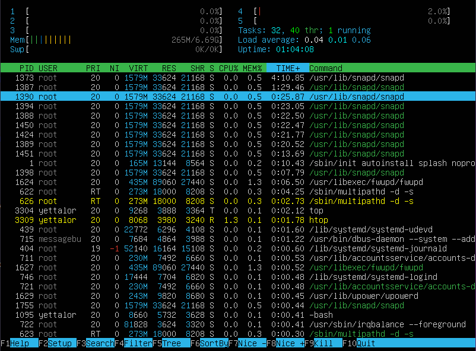

отфильтрованному для процесса sshd

с процессом syslog, найденным, используя поиск

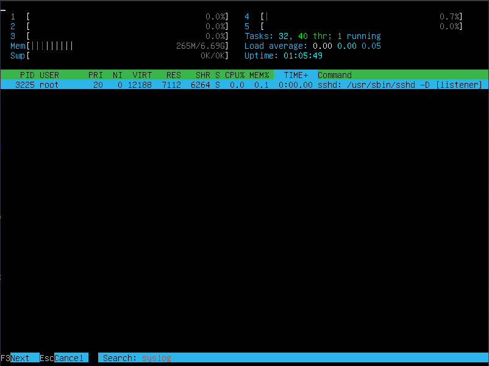

с добавленным выводом hostname, clock и uptime

<h2>Part 10. Использование утилиты fdisk</h2>

Запустить команду fdisk -l.

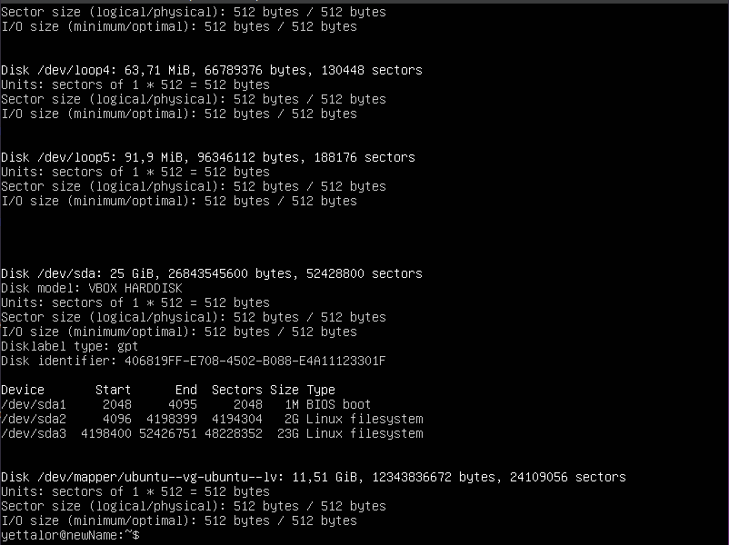

имя

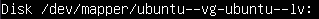

размер 11.51Gb

количество секторов 8854175744

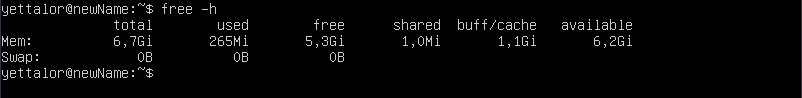
<h2>Part 11. Использование утилиты df</h2>

df

Для корневого раздела (/):

размер раздела-11758760

размер занятого пространства - 2845440

размер свободного пространства-8294212

процент использования-26

Единица измерения в выводе-килобайты

df -Th для корневого раздела (/):

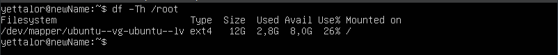

размер раздела-12Gb

размер занятого пространства-2.8Gb

размер свободного пространства-8.0Gb

процент использования-26

Tип файловой системы для раздела-ext4

<h2>Part 12. Использование утилиты du</h2>

Вывести размер папок /home, /var, /var/log (в байтах)

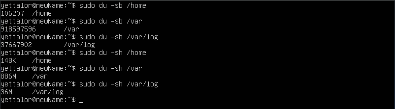
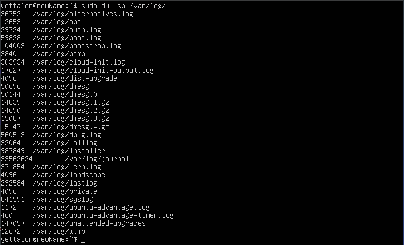

Вывести размер всего содержимого в /var/log (не общее, а каждого вложенного элемента, используя *)

<h2>Part 13. Установка и использование утилиты ncdu</h2>

Установить утилиту ncdu.

Вывести размер папок /home, /var, /var/log.

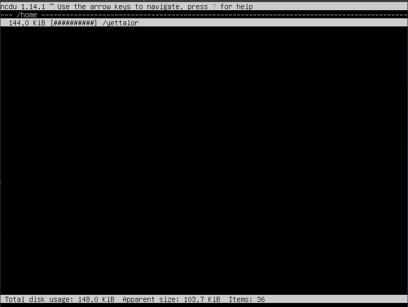

<h2>Part 14. Работа с системными журналами</h2>

dmesg

syslog

auth

время последней успешной авторизации- Jan 15 12:30:20

имя пользователя-newName

метод входа в систему-sudo

Перезапустить службу SSHd.

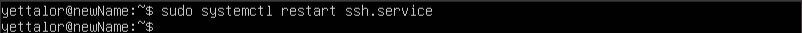

<h2>Part 15. Использовиние планировщика заданий CRON</h2>

uptime

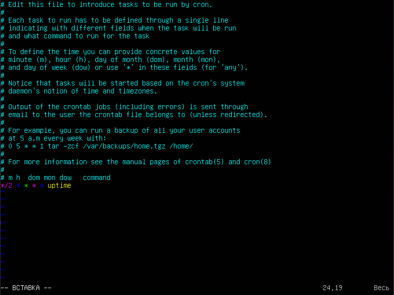

Найти в системных журналах строчки (минимум две в заданном временном диапазоне) о выполнении.

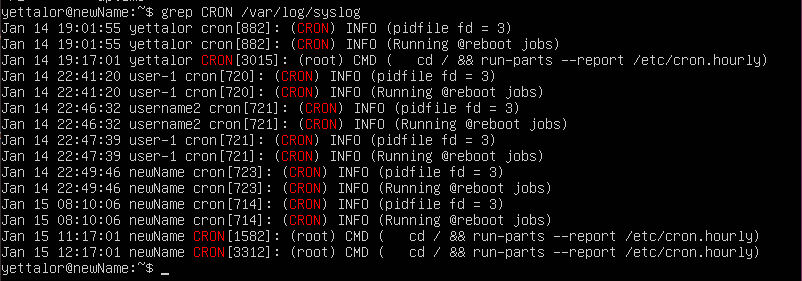

список текущих задач

Удалите все задания из планировщика заданий.

